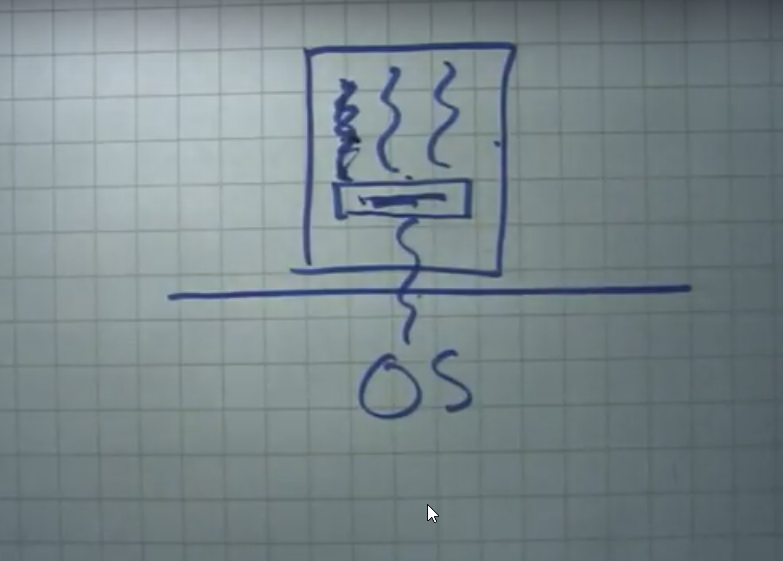
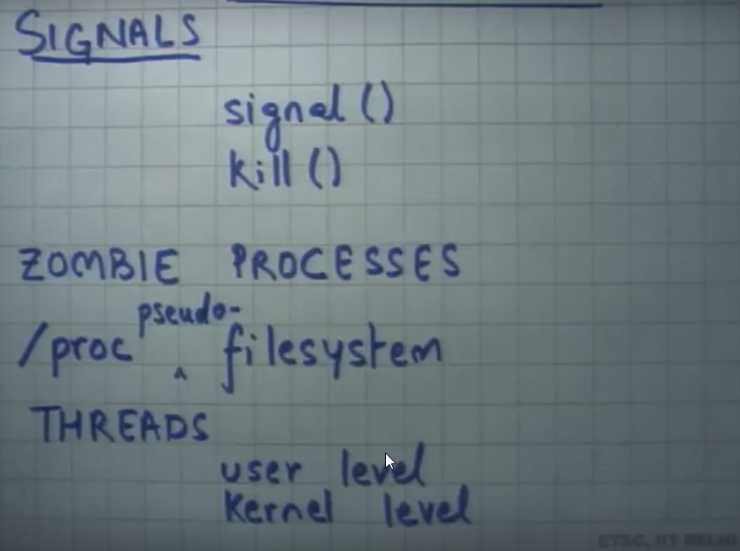

**Signals**
* Kill and signal
* SIGINT (SigNum,handler)
  * Interruption of Signals
* SIGSTP
* SIGSEGV
  * Segmentation fault
* SIGCHLD
  * one of the child processes exits
* ls &
    * it uses the SIGCHILD and lets the new process spawn.
* Kill (pid, singnum)
  * kill -9 pid
  where -9 is the SIGKILL
* open |  read | write | close
* the above can be used to find the number of process in the system and which process is allocated to which address spaces
* ps - list all processes and dependencies
* top - CPU and memory

* How can a system call be given at a macro level saying that how much ?
  * Using pseudo file system
  -> /proc is pseudo file system
    -> contains al PIDS
  -> All the things OS needs to expose will be done at the /proc and application can just use them
  * Lets say the two process p1 and p2 uses the same address space to share the information so it becomes cheaper
  * it called threads -> it uses two processes and address spaces and its exceution flow. Two thredas can have two diffrent flows
  *  Process is threads and address spaces.
  * For multi processor system you need to use the multi thread to access others effectively.
  * Advantage of threads over processes is they use the same address spaces so its faster than processes
  * Disadvantge no isolation, two threads need to trust each other-> as they are in same address spaces.
  * Creation of threads:
    -> Kernel Level Threads: Give it to OS and let OS handle them multiples of them and THreds are 1st class entity
    -> USer level threads: You create them and OS sees as only 1 Big process conatining more threds.
  * 
  * You can use the **scheduler** to schedule the threads based on the availabity
  * Summary:
  *  
