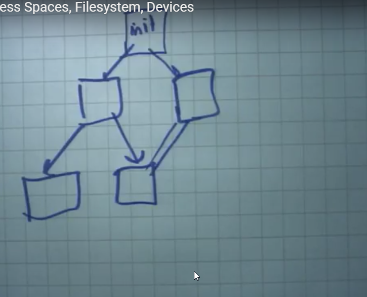

* Processor, Memory(volatile) and Disk
* We had to look at the shell and execution or interaction with the kernel and how the major three processes
  * Fork()
    * makes a system call /copies new process and make them out of
  * exec()
   * exceutes overides on the current process
 * exit() are used within the context of OS
 * dup
 * pipe
* Then usage of the file descriptor fd
  -> open
  -> read
  -> write
  -> close
 * the 0,1,2 of the FD tables such as stdinput, stdoutput and stderror

**File manipulation  (conventional way)**
 * sort > file.txt < tmp1
 * uniq > tmp1 < tmp2
 * wc < tmp3
 * rm tmp1 tmp2 tmp3

* OS usually provides gates in which it can access something, remember story who can access within the **root** access and which can
access as the someoneelse. As resources are shared between all users

**PIPES**
+  sort < file.txt | uniq | wc
* based on the scheduling the producer or consumer works or acts accordingly.
* Wc will always work until the EOF is reached, even though it started in parllel but it waits until EOF.
* 
* A process is untrusted resources where it may be malicious, buggy or it may take too much spaces etc..,
* Înter process commnication is communication between internal process
* 
*  Tne process tress starts as the init process and shell is oone of the process and so other processes
