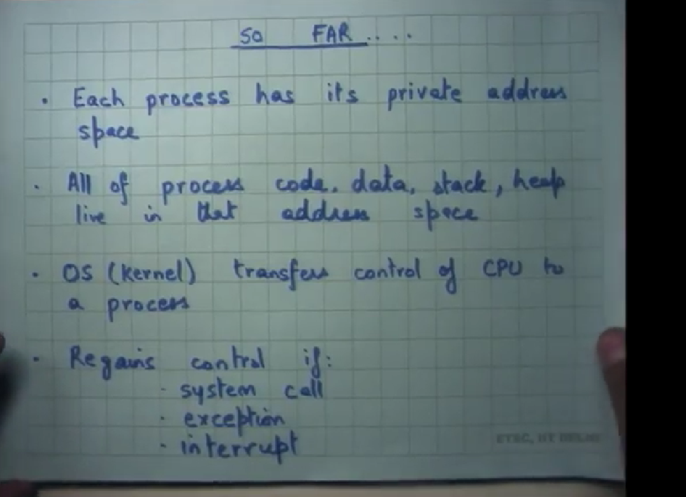
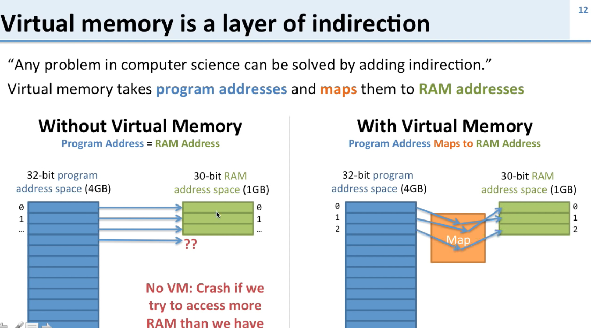
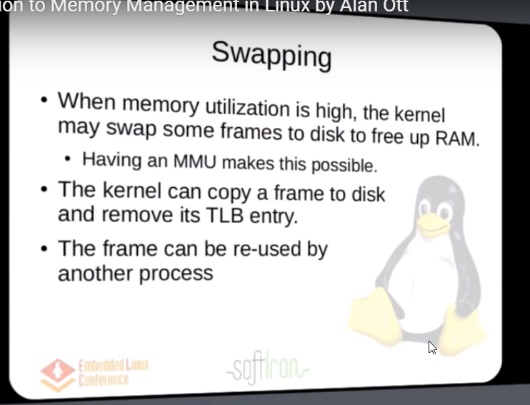

Processes in Action:

* 
* https://www.youtube.com/watch?v=qcBIvnQt0Bw&list=PLiwt1iVUib9s2Uo5BeYmwkDFUh70fJPxX
* 2 pow 32 is 4 Gb of memory
* Virtual memory solves the main problems with physical memory addresses.
* 
* 
top/htop/free -g
